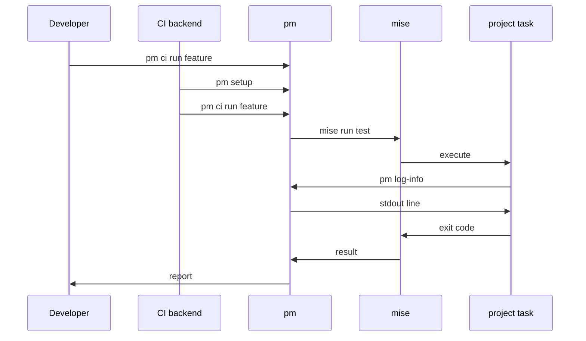

# CLI surface and command shape

- Status: proposed
- Deciders: @cloudvoyant
- Date: 2026-09-09

## Context and Problem Statement

Three callers invoke the premise CLI: a developer at a prompt, a mise task inside a project, and a CI backend. A rendered task that calls `premise log INFO ...` stores that spelling in every descendant repo. The command surface becomes a public contract at the first release.

What are the commands, and what is the short form?

## Decision Drivers

- Generated task scripts contain the command text, so length costs real bytes and real typing.
- Non-interactive callers run most invocations, so a convenience that works only at a prompt is the wrong default.
- Every command must name a concept from [ADR-0001](0001-core-concepts.md). A verb without a concept is surface area without meaning.
- Selection must work the same way in every command, or each command grows its own filter dialect.

## Considered Options

- Ship `premise` only
- Ship `premise` and document a shell alias
- Ship `premise` and install `pm` as a second name for the same binary

## Decision Outcome

Chosen option: "install `pm` as a second name", because rendered task scripts call it. A shell alias lives in one shell. CI and non-interactive shells do not load it, so rendered content cannot depend on one.

### Command tree

This is the planned command surface. The current alpha registers only implemented commands (`init`, `generate`, and `template`); future commands remain absent until their behavior lands.

```text
pm
|
+-- init            (i)   write premise.yaml into this repo
+-- generate        (g)   render a new project from a template
|     [template]          no argument: list the options
+-- update          (u)   migrate one object to a newer version
|     [version]           no argument: latest that satisfies the range
+-- setup                 prepare the CI backend environment
|                         secrets, caching, registry auth
+-- ci
|    +-- ls               list configured workflows
|    +-- dag              print the task DAG
|    +-- run <workflow>   run the tasks of one workflow
|          --filter, -F   select a subset (repeatable)
+-- log <LEVEL> <msg>      colored log line
|
+-- log-info <msg>         flat forms, for task scripts
+-- log-warn <msg>
+-- log-error <msg>
+-- log-debug <msg>
```

### Commands and the concepts they name

| Command                  | Alias | Concept from ADR-0001 | Action                                      |
| ------------------------ | ----- | --------------------- | ------------------------------------------- |
| `pm init`                | `i`   | project               | Write `premise.yaml`                        |
| `pm generate [template]` | `g`   | project, block, base  | Render one project into a directory         |
| `pm update [version]`    | `u`   | migration             | Move one object to a newer template version |
| `pm setup`               |       | CI backend            | Resolve secrets and configure the runner    |
| `pm ci ls`               |       | task                  | List workflows                              |
| `pm ci dag`              |       | task                  | Print the dependency graph                  |
| `pm ci run <workflow>`   |       | task                  | Run the tasks of a workflow                 |
| `pm log <LEVEL> <msg>`   |       | task                  | Write one log line                          |

### Where each caller enters



`pm ci run <workflow>` resolves the workflow to a project task graph. premise invokes each named mise task. The CI backend does not run build-system commands.

The project task calls back into `pm` for logging. That is why the flat form exists.

### Shape rules

Install `pm` next to `premise`. Both names run the same binary. Rendered task scripts use `pm`, so the short name must exist on every machine that runs a task.

Register each log level as a top-level command. A task script calls a log command on most lines. At that call site `pm log INFO` carries a parent command that adds nothing. Keep the nested form for discovery. Render the flat form into scripts.

Use `--filter` as the only selection mechanism. It matches a project ID, a path glob, or a tag. A filter that a user learns in one command works in every command.

Name the migration command `update`. A platform author ships a migration. A consumer runs `pm update`. A second verb such as `pm migrate` implies two mechanisms where one exists.

State the scope in every command that writes. `update` takes one object. premise offers no repo-wide update, because migrations run per object.

## Positive Consequences

- A rendered task depends on `pm`, so generated scripts stay short and identical across repos.
- One filter dialect covers every command that selects.
- Command names follow concept names, so the CLI documents the model.

## Negative Consequences

- `pm` is short, so another program can already hold that name on a user PATH.
- Descendant repos contain the command text, so a rename becomes a migration instead of a release note.
- Two spellings exist for each log level.

## Pros and Cons of the Options

### Ship `premise` only

- Good, because one name collides with nothing and needs no install step.
- Bad, because every logging line in a rendered task carries the long name.
- Bad, because users write their own aliases, which creates one dialect per machine.

### Ship `premise` and document a shell alias

- Good, because it costs nothing and collides with nothing.
- Bad, because rendered tasks cannot use it. An alias loads per shell and is absent in CI.
- Bad, because the short form is missing in the place that types it most.

### Ship `premise` and install `pm`

- Good, because rendered tasks and CI backends use it.
- Good, because the long name stays for documentation and discovery.
- Bad, because it claims a two-letter name on the user PATH.
- Bad, because install documentation must state that both names run one binary.

## Open Questions

- Name collision. If `pm` already exists on the PATH, premise can refuse to install it, install it and warn, or offer an opt-out. Undecided.
- Machine-readable output. `pm ci dag` must emit JSON for CI matrix generation. Whether that is a global `--json` flag or a per-command flag is undecided.
- Whether `setup` belongs on the CLI. It sits there because it runs before any task exists. That is an argument from bootstrap order, not from ownership.

## Links

- Refines [ADR-0001](0001-core-concepts.md), which defines every concept the commands name
- [mise tasks](https://mise.jdx.dev/tasks/), the execution surface these commands call
