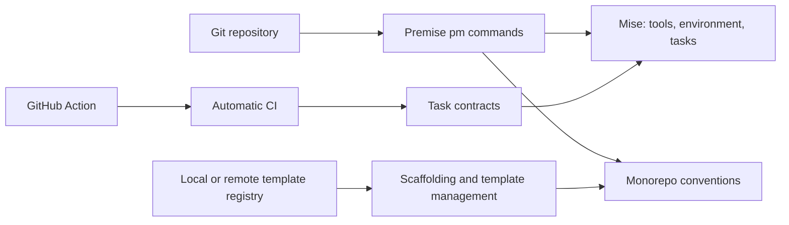

# Architecture

## Overview

Premise is a Git-native platform engineering toolkit. It uses Git repositories, Mise, monorepo conventions, task contracts, templates, and CI workflows to make development and delivery consistent across projects.

Premise includes project generation today, but the whole product is not permanently create-only. Generation currently creates new projects without overwriting destinations; template migration and other lifecycle capabilities are planned as separate workflows.

## Requirements

- Manage development environments, including tool versions, environment values, and installation through `pm install` and Mise.
- Provide a lightweight, package-manager-forward monorepo model that does not replace the package manager's dependency and workspace responsibilities.
- Provide a task runner through `pm run`, layered over Mise tasks and monorepo conventions.
- Derive automatic CI from task contracts so projects expose stable lifecycle names instead of provider-specific task glue.
- Scaffold projects and generate them from local or remote templates.
- Support future template migration for existing projects without changing the create-only generation workflow.
- Establish future standardized infrastructure and secret management without making those planned systems appear implemented today.

## Design

The architecture has four cooperating components:

| Component                                                 | Responsibility                                                                                                                                                                                                                    |
| --------------------------------------------------------- | --------------------------------------------------------------------------------------------------------------------------------------------------------------------------------------------------------------------------------- |
| **Development Environment (`pm install` / Mise)**         | Mise owns declared tools, versions, environment resolution, and installation. Premise provides the workspace entry point and conventions around that environment.                                                                 |
| **Monorepo and Task Runner (`pm run` layered over Mise)** | Premise discovers the workspace and its projects, applies `apps/` and `libs/` conventions, and routes root or project task requests to Mise. Package managers remain responsible for package dependencies and workspace behavior. |
| **Scaffolding and Template Management**                   | `template_registry` declares selectable templates and explicit repository-root workspace files. A repository can also contain generated projects. Generation applies answers and creates one nested project.                      |
| **Automatic CI (GitHub Action and task contracts)**       | The GitHub Action installs the required environment and invokes `pm ci flow`. Contract task names give the CI flow a stable interface while each project owns the task implementation.                                            |

Premise currently implements environment setup, monorepo task routing, scaffolding, template-root merging, and contract-driven CI. Template migration, standardized secret management, and standardized infrastructure are planned rather than implemented. Infrastructure providers and ownership boundaries remain future design work.

## Implementation

Mise owns tools, environments, and task execution. Premise manages monorepo conventions on top of Mise and uses task contracts for CI.

Generation relies on the expected monorepo structure when it selects a destination and records provenance. Template registry and generated-project capabilities may coexist; `workspace.kind` selects default CI behavior rather than enforcing exclusive repository contents.

Premise imposes conventions around secret management and artifact publishing. These conventions protect credentials and provide consistent release interfaces, but they do not yet constitute a complete standardized secret-management or infrastructure platform.

Infrastructure ownership is future work. Provider-specific infrastructure, provisioning, and long-term ownership rules must be defined by a later architecture and are not part of the current implementation.

The detailed create-only generation and template-root merge design is documented in [Generation Architecture](generation.md). The focused merge policy remains in [ADR 0003](../adr/0003-template-root-merging.md).

## References

- [User Guide](user-guide.md)
- [Generation Architecture](generation.md)
- [Infrastructure](infrastructure.md)
- [ADR 0003: Focused template-root merge policies](../adr/0003-template-root-merging.md)
- [Mise configuration](https://mise.jdx.dev/configuration.html)
- [GitHub Actions](https://docs.github.com/en/actions)
