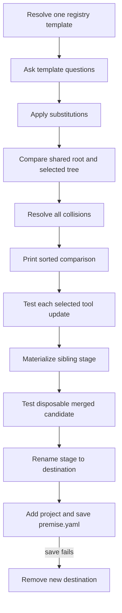

# Architecture

## Overview

Premise is a create-only monorepo project generator and lifecycle command-line interface (CLI). The Go packages under `core/` own manifests, registry discovery, generation, Mise execution, and release behavior. The design keeps project creation deterministic and tests generated candidates before they enter a workspace.

## Components

| Component                                        | Responsibility                                                                                                  |
| ------------------------------------------------ | --------------------------------------------------------------------------------------------------------------- |
| `cmd/`                                           | Parse CLI commands, resolve selectors, and construct interactive dependencies.                                  |
| `core/registry.go`                               | Resolve local and remote registries and select one declared template.                                           |
| `core/generate.go`                               | Orchestrate questionnaire answers, root comparison, validation, destination creation, and manifest persistence. |
| `core/merge.go`                                  | Build a sorted merge plan and apply file-specific root collision policies.                                      |
| `core/misex_config.go` and `core/misex_merge.go` | Extract typed Mise data and merge tools, tasks, environment values, lists, and unknown root keys.               |
| `core/template.go`                               | Own the prepared scaffold lifecycle and the same-filesystem rename into the destination.                        |
| `core/template_validation.go`                    | Test isolated tool changes and complete merged candidates in disposable directories.                            |
| `core/config.go`                                 | Load, validate, and save `premise.yaml`.                                                                        |

## Generation flow

The comparison covers regular files directly under the registry `templates/` root and every entry in the selected template tree. Sibling template directories never become shared content. The plan lists only paths present on both sides.

## Root merge policies

`.gitignore` and `.gitattributes` use an ordered line merge. Premise normalizes carriage-return line-feed (CRLF) endings and terminal newline differences. It keeps shared lines first and selected lines second, removes only adjacent identical lines, and writes one trailing newline.

`mise.toml` uses typed extraction before composition. Compatible numeric tool versions within one major version select the greater version. Task command sequences append in shared-first order. Other lists use stable shared-first deduplication. Environment conflicts can keep shared, use selected, rename the selected key, or abort. A rename changes only complete selected-side `${NAME}`, `$NAME`, and `env.NAME` references.

All other differing files use a complete-file decision. Premise keeps the chosen bytes and file mode. Equal bytes and modes coalesce without a prompt.

## Validation boundaries

A selected-template tool change runs in its own disposable copy before the complete merge is materialized. This identifies the exact dependency update that breaks the selected template. Each preflight runs `mise install` and every required contract for the template kind with `PREMISE_TEMPLATE_TEST=1`.

The complete merged stage is copied to another disposable directory. Premise runs the same install and contract checks there. Mise artifacts cannot leak into the stage that becomes the destination.

## Persistence and failure handling

Preparation creates an empty temporary stage next to the destination. This keeps the final rename on one filesystem. The stage remains private until all merge decisions and validation checks pass.

After validation, Premise rechecks that the destination does not exist and renames the stage. It then adds the project record and saves `premise.yaml`. If project registration or manifest saving fails, Premise removes only the new destination.

This flow intentionally has no lock, journal, transaction directory, recovery state, platform-specific atomic wrapper, schema migration, or existing-project update path. Concurrent external writers and crash-consistent updates across the destination and manifest are outside this design.

## Extension rules

Add a smart-file handler only when the file format has defined ordering, override, comment, and normalization semantics with tests. Do not route arbitrary configuration files through the ordered-line or TOML handlers. Existing-project template upgrades require a separate design.

## References

- [User Guide](user-guide.md)
- [ADR 0003: Merge template roots with focused policies](../adr/0003-template-root-merging.md)
- [Mise configuration](https://mise.jdx.dev/configuration.html)
- [Git attributes](https://git-scm.com/docs/gitattributes)
- [Git ignore](https://git-scm.com/docs/gitignore)
