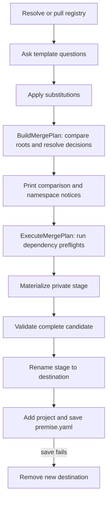

# Architecture

## Overview

Premise is a create-only monorepo project generator and lifecycle command-line interface (CLI). The Go packages under `core/` own manifests, registry discovery, generation, Mise execution, and release behavior. The design keeps project creation deterministic and tests generated candidates before they enter a workspace.

## Components

| Component          | Responsibility                                                                                                                                                                                   |
| ------------------ | ------------------------------------------------------------------------------------------------------------------------------------------------------------------------------------------------ |
| `cmd/`             | Parse CLI commands, resolve selectors, and construct interactive dependencies.                                                                                                                   |
| `core/registry.go` | Resolve local and remote registries and select one declared template.                                                                                                                            |
| `core/generate.go` | Resolve the registry, ask questionnaire questions, invoke the merge plan, and persist the project manifest entry.                                                                                |
| `core/merge.go`    | Build comparison and decisions with `BuildMergePlan`; let `ExecuteMergePlan` own private staging, dependency preflights, materialization, complete-candidate validation, and destination rename. |
| `core/misex.go`    | Provide the Mise process boundary and consolidated typed `mise.toml` extraction and composition, including tool, environment, and task rules.                                                    |
| `core/template.go` | Resolve template directories, apply substitutions while copying trees, and run template contracts.                                                                                               |
| `core/config.go`   | Load, validate, and save `premise.yaml`.                                                                                                                                                         |

## Generation flow

The comparison covers regular files directly under the registry `templates/` root and every entry in the selected template tree. Sibling template directories never become shared content. Collisions are shown in path order, while one-sided paths are copied without a decision.

## Root merge policies

### Tier 1: root `mise.toml`

The root `mise.toml` is decoded as typed data. Tool selectors use Mise-specific semantic rules: compatible version selectors within one major version choose the greater version, incompatible major versions fail, and other conflicts use an explicit choice. Environment conflicts can keep shared, use selected, rename the selected key with selected references updated, or abort.

Contract task collisions retain selected metadata and compose commands in shared-first, selected-second order. Root contract tasks are expected to be argument-free. Non-contract task collisions keep the shared task name, copy the selected task under `<registry-prefix>:<task>`, and print a notice naming the namespace.

### Tier 2: `.gitignore` and `.gitattributes`

These files use ordered line handling with shared lines first and selected lines second. Premise normalizes CRLF and terminal newline differences and removes only adjacent duplicate lines because line order has meaning for Git policy.

### Tier 3: other differing root files

All other differing root files use a complete-file decision: keep shared, use selected, or abort. Equal files need no decision. Premise does not apply semantic merges to editor configuration, Prettier files, package manifests, or arbitrary ignore files.

## Validation boundaries

`BuildMergePlan` prepares the comparison, resolves collisions, and records the typed Mise result without creating the destination. `ExecuteMergePlan` first runs a dependency preflight for each selected-template tool version changed by the shared configuration; each preflight uses a disposable copy, `mise install`, and every required template contract.

After materialization, `ExecuteMergePlan` copies the complete stage to another disposable directory and runs `mise install` plus every required contract there. Mise artifacts stay out of the stage that becomes the destination, and the destination is renamed only after complete validation succeeds.

After the rename, generation registers the project and saves `premise.yaml`; if either operation fails, it removes the new destination. Crash-consistent updates across the destination and manifest are out of scope.

## Extension rules

Add a smart-file handler only when the file format has defined ordering, override, comment, and normalization semantics with tests. Do not route arbitrary configuration files through the ordered-line or typed Mise handlers. Existing-project template upgrades require a separate design.

## References

- [User Guide](user-guide.md)
- [ADR 0003: Focused template-root merge policies](../adr/0003-template-root-merging.md)
- [Mise configuration](https://mise.jdx.dev/configuration.html)
- [Git attributes](https://git-scm.com/docs/gitattributes)
- [Git ignore](https://git-scm.com/docs/gitignore)
