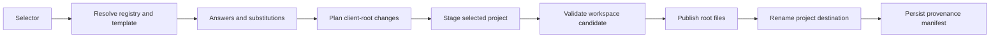

# Generation Architecture

## Overview

Premise generation is create-only. It resolves one template, merges the registry's direct shared files into the client workspace root, creates one project under `apps/<name>` or `libs/<name>`, validates the resulting workspace candidate, and records the project's provenance.

Generation does not overwrite an existing project destination or update an existing project. Template migration is a separate future workflow.

## Requirements

- Resolve a selector to a registry and one declared template, whether the source is local or remote.
- Apply questionnaire answers and literal substitutions to both shared registry files and selected-template files.
- Merge direct registry files against files at the client workspace root.
- Copy the selected template tree only to its new `apps/<name>` or `libs/<name>` destination.
- Never treat selected-template files as conflicts with client-root files.
- Never overwrite an existing project destination.
- Validate changed root tool versions independently and validate the complete workspace candidate before publication.
- Persist template provenance, including the selector, project path, answers, and declared version when available.
- Restore changed workspace-root files and remove the new project if final project registration or manifest persistence fails.

## Design

### Registry structure

A registry has a manifest and a `templates/` directory. Regular files directly under `templates/` are client-workspace-root inputs. The selected template is the tree at `templates/<name>/`; sibling template directories are excluded.

For example, `templates/package.json`, `templates/bunfig.toml`, and `templates/mise.toml` become or merge with files at the client workspace root. Files under `templates/premise-hono-api/` are copied to `apps/<generated-name>/`. These two target locations are independent, so equal relative paths such as `package.json` or `mise.toml` do not conflict with each other.

Selector resolution first identifies the registry source and then the template declaration. Local selectors can point at a registry on disk. Remote selectors identify a repository and template, and the source is fetched or refreshed through the registry cache. `ResolveTemplateSource` returns the source root and selected `TemplateSelection`.

### Three-tier workspace-root merge

Only a direct shared file that meets an existing client-root path needs collision handling:

1. **Tier 1: root `mise.toml`.** The registry's shared Mise configuration merges with the existing client workspace Mise configuration. Compatible tool versions can select the greater version within one major version; incompatible major versions fail. Environment and other scalar conflicts require a decision. Contract task collisions retain client metadata and append registry commands before client commands. Non-contract task collisions retain the registry task name and namespace the client task as `<registry-prefix>:<task>`.
2. **Tier 2: root `.gitignore` and `.gitattributes`.** Registry lines are followed by client lines, and only adjacent duplicates are removed.
3. **Tier 3: other differing root files.** The complete registry file, complete existing client file, or an abort is chosen. Premise does not attempt semantic merging for arbitrary configuration files.

A shared file whose root path does not exist is copied without a decision. Equal files coalesce. Files in the selected template never enter this comparison.

## Implementation

`BuildGeneratePlan(GenerateParameters)` validates the client workspace, absent project destination, registry root, and selected template. It stages the substituted selected tree without merging shared files into it. It separately reads direct shared files, compares only those paths against the client workspace root, and resolves the three merge tiers.

`ApplyGeneratePlan` materializes the selected project in a private stage. For validation, it creates a disposable workspace candidate containing the client root files, planned root-file outputs, and the selected project at its final relative path. It validates the candidate root Mise installation, runs root contracts when the root defines the complete contract, and runs the selected project's complete contract. Successful command output remains hidden; the first failed command's diagnostics are shown.

After validation, Premise writes the planned direct root files and renames the staged project into its destination. It keeps in-memory copies of changed root files until the workspace manifest is saved. A publication or manifest error restores those files and removes the new destination. There is no lock, journal, crash-recovery protocol, platform-specific transaction wrapper, or existing-project migration.

`core/misex.go` owns typed Mise extraction, encoding, mutation, and merge behavior. `core/merge.go` owns file-level decisions. `core/generate.go` owns planning, staging, workspace-candidate validation, root publication, and destination publication.

Migration of an existing project from one template version to another remains separate future work.

## References

- [Overall Premise Architecture](architecture.md)
- [User Guide](user-guide.md)
- [ADR 0003: Focused template-root merge policies](../adr/0003-template-root-merging.md)
- [Mise configuration](https://mise.jdx.dev/configuration.html)
- [Git attributes](https://git-scm.com/docs/gitattributes)
- [Git ignore](https://git-scm.com/docs/gitignore)
